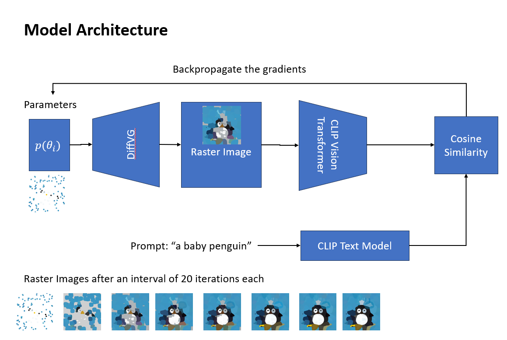

# StableVectors

Generate Stable Vector graphics representations from text prompts using CLIP + DiffVG



# Installation

Use a conda environment

```bash
conda create -n stablevectors python=3.7 jupyter ipython ipykenel ipywidgets
conda activate stablevectors
```

## Install DiffVG

```bash
git clone https://github.com/BachiLi/diffvg.git
cd diffvg
git submodule update --init --recursive
conda install -y pytorch torchvision -c pytorch
conda install -y numpy
conda install -y scikit-image
conda install -y -c anaconda cmake
conda install -y -c conda-forge ffmpeg
pip install svgwrite
pip install svgpathtools
pip install cssutils
pip install numba
pip install torch-tools
pip install visdom
python setup.py install
```

If ran into some errors checkout issue 59 in diffvg

https://github.com/BachiLi/diffvg/issues/59

## Install CLIP

```bash
pip install clip
```

# Generating SVG

```bash
python main.py --config config.yaml --experiment experiment_8x1 --signature penguin --prompt a baby penguin --num_iter 200
```
